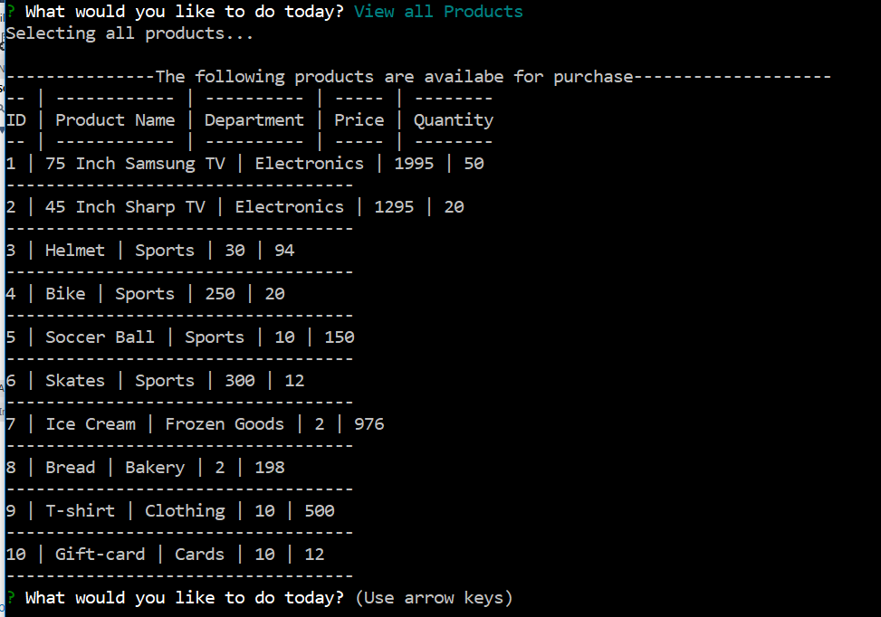

#Bamazon

Welcome to Bamazon - a unique Command Line Instruction(CLI)-based shopping experience.

* Customers - shop for the latest products!
* Managers - view low inventory items and restock!
* Supervisers - review your P&L reports for each department and see the best performing ones!

## How it works

Bamazon s an Amazon-like storefront built with MySQL. It allows customers to take in orders and depletes stock from the inventory. The app tracks product sales across store's departments and provides a summary of the highest-grossing departments in the store.

This is a mySQL assignment completed in Week 12 of the UoT Coding bootcamp

## Built with

* Node.js
* MySQL
* Inquirer

## Customer View

### How I built it

 - Create MySQL database, bamazon
 - Create table in bamazon called products. Products has the following columns:
   * item_id (unique id for each product)

   * product_name (Name of product)

   * department_name

   * price (cost to customer)

   * stock_quantity (how much of the product is available in stores)
- Populate products table with at least 10 products.
- Create a Node application called `bamazonCustomer.js`. Running this application first displays all of the items available for sale, including the ids, names, and prices of products for sale.
- Use Inquirer todisplay user prompts:
   * Ask the ID of the product they would like to buy.
   * Ask how many units of the product they would like to buy.
-  Once the customer has placed the order, application checks if there is enough stock of the product to meet the customer's request. If not, the app displays the message `Insufficient quantity!`, and then prevents the order from going through. The app asks the user if they would like to continue shopping.
- If the store has enough of the product, the app displays to the user to total cost of the purchase and then updates the DB to display remaining quantity.

### How it works

* To start the app, type node bamazonCustomer.js in the terminal. The app displays a list of available products and asks the user if they would like to shop. Note: The app only displays products that are in stock. If the stock quantity of a product is zero, it is not displayed to the user. If the user selects "NO", the app stops and disconnects from the mySQL database. 

* When the user opts to continue shopping, the app displays a list of items they can select from.

* Once the user selects the product, the app prompts them to enter to quantity they'd like.

* If there is insufficient stock to fulfill the order, the app displays the message "Insufficient Produtcs" and prompts the user if to continue shopping.

* If there's enough stock to fulfill the order, the app displays the total purchase price, updates the database by decreasing the stock_quantity by the quantity purchased and then the app propmts the user to continue shopping.

## Manager View
To start the app, type node bamazonManager.js in the terminal

A manager can use this application to:

* View Products for Sale: If a manager selects View Products for Sale, the app lists every available item: the item IDs, names, prices, and quantities.
* View Low Inventory; If a manager selects View Low Inventory, the app displays a list of items with an inventory count lower than five.
* Add to Inventory: If a manager selects Add to Inventory, the app displays a prompt that allows the manager "add more" of any item currently in the store.
* Add New Product: If a manager selects Add New Product, the app allows the manager to add a completely new product to the store.
* Delete Products: The manager can delete any product.

### Manager View Screenshots

Manager Menu

Manager Product View

Manager View Low Inventory

Manager Add Product Stock

Manager Add New Inventory

## Manager View
To start the app, type node bamazonSupervisor.js in the terminal

Supervisor Menu

Supervisor View Product sales by department

Supervisor add a new department

## Database Schema

The database has 2 tables; products and departments.

